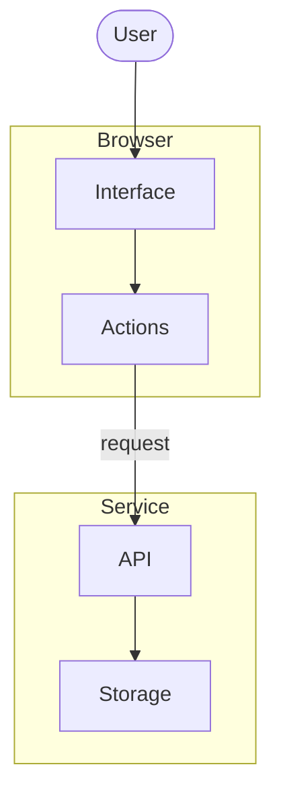

# Modules

A small interactive module diagram.

```mermaid
flowchart TB
  user(["User"])
  subgraph client["Browser"]
    direction LR
    ui["Interface"] --> actions["Actions"]
  end
  subgraph service["Service"]
    direction LR
    api["API"] --> store["Storage"]
  end
  user --> ui
  actions -->|request| api
```
